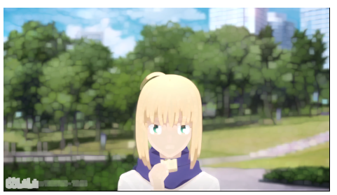
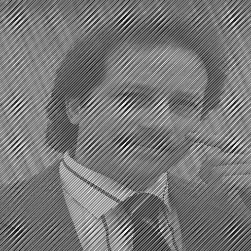
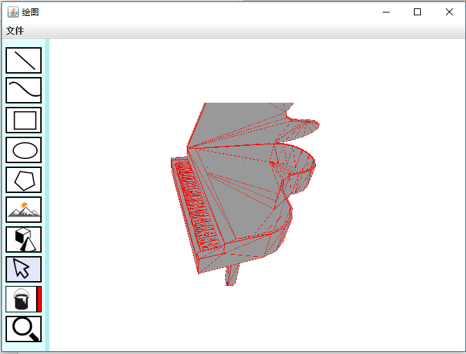

# MyPainter使用说明
 
 
 
 
 
 
 
 
 
 
 
 
 
 
冷嘉怿 161220061 <824543859@qq.com>
 
 
 
 
 
 
 

 
 
 
 

使用说明
========

本系统使用java8作为开发语言，使用了第三方数学计算库jama和库JOGL。

通过双击mypainter.jar即可运行程序。

编译命令已经整合到make.bat/make.sh中，在/src/project/文件夹下运行对应脚本文件即可完成编译。

由于添加3D功能后ToolBar视图更新，因此之前的演示图片未包括3D形状，但不影响使用说明。

主界面
------

本程序贯彻了简约设计理念，打开程序后可见到如下界面：

其中最大的白色区域为可以绘图的画板，刚打开时默认为绘制直线，可以通过点击左侧的浅蓝色竖线打开侧边栏切换绘制的形状。侧边栏再次点击蓝线可以隐藏。

形状的添加
----------

侧边栏目前有九个按钮，分别为直线、曲线、矩形、椭圆、多边形、图片选择、填充和放缩按钮，点击对应的按钮后就会切换到对应的绘制模式。不同的形状绘制方法有些区别。

形状图例如下：

直线：

### 直线

**直线**  的绘制通过使用鼠标点击起始点后移动鼠标即可拖拽出一条直线，确定终点后再次点击鼠标即可完成绘制。已经实现直线反走样算法使绘制的直线更加平滑

### 曲线

**曲线**  在选择后可以选择**点数**参数，为贝塞尔曲线的控制点数+2（两个端点），默认为3，绘制方法和直线一样：

在绘制后可以通过选择工具拖动改变控制点（橙色）的位置改变曲线形状。（下图为点数为5的曲线示例）

### 矩形和椭圆

**矩形**和**椭圆**在绘制是和直线类似，通过点击鼠标选择起始位置，之后拖动鼠标选择终点的位置，程序会在起点和终点组成的矩形空间中绘制矩形/椭圆。（下图为示例）

### 多边形

**多边形**  为一个可以有无限边数的封闭曲线，可以通过鼠标左键不断点击添加新的点，绘制好后点击鼠标右键即可封闭曲线

### 图片

**图片**  的加入和矩形类似，首先选中进入模式后在画布上绘制一个矩形确定插入图片的区域，如下图：

之后使用选择工具选中灰色区域边缘，在弹出的悬浮窗中点击文件-\>打开之后即可选择添加的图片

添加后再次点击空白区域，程序会根据图像大小调整图片区域的大小使得刚好包裹图像，效果如下图：

再次进行上述操作可以更改图片。

### 3D模型

**3D模型**  同样以矩形的方式添加，本程序仅支持.off格式模型的添加。进入3D模式后绘制一个矩形区域用来放置3D模型：

之后通过拖拽的方式添加一个off格式模型：

拖拽其他文件可以更改模型。

选择形状
--------

**选择**模式 下当鼠标接近一个形状边缘时该形状会变色高亮（蓝色）

高亮状态点击鼠标左键即可选择该形状，并进行后续编辑。

点击空白处或切换状态可以取消选择。

形状填充
--------

在 **填充** 按钮  右侧有一个颜色条显示当前填充颜色，点击可以选择填充的颜色，比如我们选择黄色进行填充 

填充模式下鼠标会变为油漆桶图案：  ，左上角的黑色箭头即为有效选择区域，使用方法和选择模式相同，接近形状边缘时会高亮，此时点击即可填充该形状。

>   选择填充颜色时，将Alpha值设置为0可以取消填充（透明度为0时将不调用填充算法）。

放缩功能（裁剪）
----------------

进入**放缩**  后会在左下角显示一个滑动条，右下角显示一个缩略图：

>   拖动滑动条即可改变放大比例，放大范围为100%-500%：

>   右侧的缩略图中有一个小的蓝色矩形框，可以通过鼠标拖动改变当前显示范围：

>   再次点击  退出放缩模式，默认进入直线绘制模式。

形状编辑
--------

其他的编辑操作对不同形状不相同。

### 移动

在**选择**模式下选中图形后会显示该形状的所有**关键点**，此时在画布任意位置点击拖动鼠标都可以移动此形状。比如移动此五角星

### 旋转

图片不支持旋转，3D模型旋转见3D模型编辑。  
选中图形后会显示一个十字和一个绿色原点，十字即为旋转中心，绿色原点为控制点，可以拖动十字改变旋转中心，以五角星为例：

拖动绿色原点旋转即可控制形状的旋转：

旋转后松开鼠标即可，绿色原点会自动复位。

### 边框设置

除图片和3D模型外所有形状都支持边界的修改，默认为宽度为1的黑色边框。

在选中形状后，会在上方弹出属性栏，点击最左侧的颜色选择按钮即可选择边框颜色，在右侧“粗细”栏可以选择边框的宽度，最大宽度为3。

例如为五角星边框设置宽度为2的紫色边框：

### 形状变形

所有的灰色控制点都是可以拖动的，可以通过拖动控制点改变形状：

### 图片编辑

对图片的编辑除了常规的放缩外还加入了一些图像处理技术。在选中图像后，会弹出一个悬浮窗用来显示当前图片的信息（三种颜色的直方图，当前处理的进度条）和可进行的操作。

#### 放缩和移动

图像的放缩和移动同其他形状一致。

#### 扭曲

在选中图像后可看到上边出现45个控制点围成的74个三角形网格

拖动其中的浅蓝色控制点即可完成图像的扭曲：

#### 灰度化

**灰度化**通过“直方图操作”-\>“灰度化”使用，可将一个彩色图像转化为灰度图像。

#### 均衡化

**均衡化**通过“直方图操作”-\>“均衡化”使用，即直方图均衡化，可分别将r.,g,b三个channel的直方图均衡化

#### 二值化

**二值化**通过“直方图操作”-\>“二值化”使用，可将r,g,b三个channel利用OSTU大律法对图像进行二值化处理

对灰度化的图像处理即直接变为黑白二值图像

#### 前景背景分割

可以通过手动方式对图像三个色域进行分割，拖动直方图上的倒三角形左右移动分割线即可将分割线左侧rgb值置为0：

#### 滤波

本程序目前提供了**高斯滤波器**和**中值滤波器**对图像进行滤波，通过“邻域操作”-\>“高斯滤波”/“中值滤波”使用。

#### 形态学操作

**形态学腐蚀**和**扩张**通过“邻域操作”-\>“形态学腐蚀”/“形态学扩张”使用。（下图为腐蚀两次的saber图片）：

**形态学扩张**（扩张三次saber的图片）：

通过腐蚀和扩张操作即可实现 “开运算”和“闭运算”：

**开运算**（先腐蚀再扩张，下图为腐蚀和扩张各两次的saber图片）：

**闭运算**（先扩张再腐蚀，下图为扩张和腐蚀各两次的saber图片，左下角水印被消除）：

#### 傅里叶变换

本程序提供二维离散傅里叶变换（DFT）运算，并转化为可编辑的能量谱图。为了增加运行效率，请将图片灰度化后再进行傅里叶变换。

通过“Fourier相关”-\>“能量谱”使用，程序将计算当前图片的傅里叶变换矩阵并转化为能量谱图显示。为了使用方便已经将能量谱图进行重新排列，将零频率移动到谱图中心，因此大部分正常图片的能量谱图应呈放射状。：

在能量谱图上点击/拖动鼠标左键对相应位置的邻域做滤波，点击/拖动右键会使对应位置能量减半。编辑后通过“Fourier相关”-\>“逆变换”即可还原原图片。

##### 使用示例

傅里叶变换可以将时域信号转换到频域进行分析，属于离散线性变换。如下图具有较大的噪声：

观察其能量谱图可以发现，在低频区域出现了一些噪声：

将这些噪声弱化：

再经过逆变换即可获得噪声较小的图片。

#### 保存图片

本程序提供保存和原图质量相当图片的功能，和添加图片类似，通过“文件”-\>“保存”之后即可保存图片。

### 3D模型的编辑

3D模型同样支持基本的放缩、平移功能，除此之外还提供视图上的编辑功能。使用鼠标点击3D模型即可对模型进行编辑。

#### 放缩

按z/x可以对模型进行放大/缩小，每次缩放比为120%。下图为放大的钢琴。

#### 旋转

使用上/下/左/右方向键和PgUp/PgDn可以使模型沿x/y/z轴旋转。下图为旋转后的钢琴

#### 移动

使用w/s/a/d对模型进行上下左右移动

删除形状
--------

**删除**形状只需在选中形状后在键盘上按下**Delete**即可。

保存
----

如需**保存**绘制结果，只需在上方菜单栏中文件选项中点击**保存**，并设置好文件的路径和文件名即可保存为jpg图片：

这里保存的图片清晰度和当前窗口像素数目一致。
