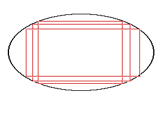

1．图元算法介绍
===============

这个月中实现了直线的DDA算法，圆和椭圆的中点生成算法和贝塞尔曲线算法。

对于连续线条，由于计算机在实际绘制中使用的是离散的像素点，因此只能尽可能的模拟真实图元的形状。对于连续图形，在绘制局部时都可以看作为线段的绘制，而对于线段，当斜率$$k
\in \lbrack 0,1\rbrack$$时，如左图所示：

为保证显示的连续性，下一点只会出现在当前位置的右下或正右侧，因此选取这两个像素点的中点，当斜率大于1/2时选择右下方的点，否则选择右侧的点。即判断点$$(x
+ 1,y + 0.5)$$在曲线上方还是下方。

下面的大部分算法在进行像素点选取时都遵循此原理。

具体原理和主要代码如下：

1.1 直线的绘制
--------------

### 算法原理

直线的绘制使用了**数值差分分析**（DDA）算法。算法利用了直线上任意两点的横纵距离比都为斜率k这一性质，通过将直线等分为e份（e为绘制直线所用像素数），每次在上一次绘制的位置基础上分别在横纵方向上增加固定距离获取下一点的位置。

### 代码分析

**public** **static** **void** drawLine(Graphics2D g, **int** x1, **int** y1, **int** x2, **int** y2, **int** LineWidth)  

{   //DDA算法  

    LineWidth++;  

    **double** dx=x2-x1;  

    **double** dy=y2-y1;  

    **double** e=Math.abs(dx)\>Math.abs(dy)?Math.abs(dx):Math.abs(dy);  

 //选择长宽中较大者作为像素点数，防止出现遗漏像素点  

    dx/=e;       //计算两个方向的差分  

    dy/=e;  

    **double** x=x1, y=y1;  

    **for**(**int** i=0;i\<=e;i++)  

    {  

        g.fillOval((**int**)(x+0.5)-LineWidth/2, (**int**)(y+0.5)-LineWidth/2, LineWidth, LineWidth);       //使用fillOval绘制像素点  

        x+=dx;   //计算下一个位置  

        y+=dy;  

    }  

}  

1.2 贝塞尔曲线的绘制
--------------------

### 算法原理

贝塞尔曲线为计算机中最常见的一种曲线，其储存代价十分小（只需一些控制点）。原理如下图：

其中$$P_{0},\ P_{1},\ P_{2},\
P_{3}$$为控制点，所有线段和被其上的点分割比都为t=0.42。不断产生新的分割点并连接为新的线段，每次迭代使得线段数量减一。当迭代结束时，黑色点即为曲线上的点，其轨迹即为n次贝塞尔曲线。

通过这个几何意义，我实现了二次贝塞尔曲线的绘制算法，具体实现见mGAlgorithm.drawCurveR3。

在真正运算时，整理坐标方程可得：

$$
\left\{ \begin{matrix}
P.x = \left( 1 - t \right)^{2}P_{0}.x + t\left( 1 - t \right)P_{1}.x + t^{2}P_{2}\text{.x} \\
P.y = \left( 1 - t \right)^{2}P_{0}.y + t\left( 1 - t \right)P_{1}.y + t^{2}P_{2}\text{.y} \\
\end{matrix} \right.\ 
$$

系数满足二项展开式，可以推广得：对于n次贝塞尔曲线

$$
\left\{ \begin{matrix}
P.x = \sum_{i = 0}^{n}{C_{n}^{i}\left( 1 - t \right)^{n - i}t^{i}P_{i}\text{.x}} \\
P.y = \sum_{i = 0}^{n}{C_{n}^{i}\left( 1 - t \right)^{n - i}t^{i}P_{i}\text{.y}} \\
\end{matrix} \right.\ 
$$

因此可以直接通过控制点集合计算获得贝塞尔曲线。

### 代码说明

BezierPoint函数根据控制点集points计算出线段比例为u时的曲线上的点  

public static dPoint BezierPoint(Point[] points, double u)  {

    dPoint loc=new dPoint(0,0);  

    int rank=points.length-1;  

    if(rank\>10)   //当次数过高时阶乘运算会导致精度下降

        return null;  

    for(int i=0;i\<rank+1;i++)   //根据公式计算两个点的坐标

    {  

        loc.x+=points[i].x\*CNum(i,rank)\*Math.pow(u,i)\*Math.pow(1-u,rank-i);  

        loc.y+=points[i].y\*CNum(i,rank)\*Math.pow(u,i)\*Math.pow(1-u,rank-i);  

    }  

    return loc;  

}  

**public** **static** **void** drawCurve(Graphics2D g, Point[] points,**int** e,  **int** LineWidth)  函数只需通过BezierPoint函数获得所有曲线上点的坐标并绘制在Outlook上即可。

1.3 圆的绘制
------------

### 算法原理

圆具有高度对称性，因此只需绘制其中1/8即可通过对称性立即得到其他部分，即$$x \in
\lbrack 0,\ \
\sqrt{}2r\rbrack$$。我们选择绘制在第一象限的上半部分，这部分切线斜率$$- 1 < k <
0$$，因此宽度大于高度，选择x轴长度作为像素个数。选择$$dx =
1$$，计算y轴坐标逐点绘制圆形，并根据圆心位置平移即可。

在逐点绘制时，根据圆方程比较$${(x + 1)}^{2} + {(y -
0.5)}^{2}r^{2}$$，当前一项大时像素中点在圆外，选择下方像素点，否则选择上方像素点。

### 代码说明

**public** **static** **void** drawCircle(Graphics2D g, **int** x0, **int** y0, **int** r, **int** LineWidth)  {  

    LineWidth++;  

    **int** x=0, y=r;  

    **while**(x\<=(**int**)r/Math.sqrt(2)+1)  { //只绘制1/8圆

        g.fillOval(x+x0-LineWidth/2, y+y0-LineWidth/2, LineWidth, LineWidth);  

        g.fillOval(-x+x0-LineWidth/2, y+y0-LineWidth/2, LineWidth, LineWidth);  

        g.fillOval(x+x0-LineWidth/2, -y+y0-LineWidth/2, LineWidth, LineWidth);  

        g.fillOval(-x+x0-LineWidth/2, -y+y0-LineWidth/2, LineWidth, LineWidth);  

        g.fillOval(y+x0-LineWidth/2, x+y0-LineWidth/2, LineWidth, LineWidth);  

        g.fillOval(-y+x0-LineWidth/2, x+y0-LineWidth/2, LineWidth, LineWidth);  

        g.fillOval(y+x0-LineWidth/2, -x+y0-LineWidth/2, LineWidth, LineWidth);  

        g.fillOval(-y+x0-LineWidth/2, -x+y0-LineWidth/2, LineWidth, LineWidth);  

        **if**((**float**)x\*x+((**float**)y-0.5)\*((**float**)y-0.5)-(**float**)r\*r\>0) 
//计算下一点坐标

            y--;  

        x++;  

    }  

}  

1.4 椭圆的绘制
--------------

### 算法原理

对于椭圆，长度大于宽度时和宽度大于长度时需要分别采用x轴和y轴采样，因此需要分为两组绘制。

由于对于椭圆上点满足下列性质：

$$
\left\{ \begin{matrix}
\frac{y}{x} \times \frac{\text{dy}}{\text{dx}} = - \frac{a^{2}}{b^{2}} \\
\frac{x^{2}}{a^{2}} + \frac{y^{2}}{b^{2}} = 1 \\
\end{matrix} \right.\ 
$$

因此代入$$\frac{dx_{0}}{dy_{0}} = - 1$$可得：$$x_{0} = \frac{a^{2}}{\sqrt{\left(
a^{2} + b^{2} \right)}}$$

绘制时同圆形类似，通过判断$$b^{2}x^{2} +
a^{2}y^{2}a^{2}b^{2}$$的大小关系判断中点是否在椭圆内。

### 代码说明

**public** **static** **void** drawOval(Graphics2D g, **int** x0, **int** y0, **int** width, **int** height, **int** LineWidth)  

{  

    LineWidth++;  

    **double** a=width/2, b=height/2;  

    **double** c=Math.sqrt(a\*a-b\*b);  

    **float** x=0,y=(**int**)(height/2);  

    **double** part1=a\*a/Math.sqrt(a\*a+b\*b);        //计算分界点  

    **while**(x\<=part1){ //绘制上半段  

        g.fillOval((**int**)x+x0-LineWidth/2, (**int**)y+y0-LineWidth/2, LineWidth, LineWidth);  

       … //绘制对称的另外三点

        x++;  //以x作为自变量，计算下一点坐标

        **if**(a\*a\*(y-0.5)\*(y-0.5)+b\*b\*x\*x\>a\*a\*b\*b)  

            y--;  

    }  

    **while**(y\>=0){               //绘制下半段    

        g.fillOval((**int**)x+x0-LineWidth/2, (**int**)y+y0-LineWidth/2, LineWidth, LineWidth);  

        … //绘制对称的另外三点

        y--;    //以y作为自变量，计算下一点坐标

        **if**(a\*a\*y\*y+b\*b\*(x+0.5)\*(x+0.5)\<=a\*a\*b\*b)  

            x++;  

    }  

1.5 矩形和多边形的绘制
----------------------

矩形和多边形都为若干直线组成，因此只需绘制多次使用直线绘制算法即可。

1.6 鼠标悬停判断
----------------

为了提供一个用户友好的界面，本程序支持鼠标悬停在形状附近时高亮显示该形状，并在点击后选中该形状做进一步修改。为此需要为不同的形状提供mShape.Isin函数判断鼠标位置$$(x_{0},\
y_{0})$$是否在形状上。

其中直线、矩形和多边形通过点到直线距离公式：

$$
d^{2} = \frac{\left( Ax_{0} + By_{0} + C \right)^{2}}{A^{2} + B^{2}}
$$

而已知两点的直线方程为

$$
\left( y - y_{1} \right)\left( x_{1} - x_{2} \right) = (x - x_{1})(y_{1} - y_{2})
$$

因此可得：$$A = y_{1} - y_{2},\ \ B = x_{2} - x_{1},\ \ C = - y_{2}B -
x_{2}A$$，当$$d^{2} < delta$$即认为选中直线。

圆和椭圆则通过距离圆心长度和半径的差值判断（椭圆和$$a^{2}b^{2}$$比较）。

贝塞尔曲线没有好的方法，只能通过遍历所有点判断。

1.7 直线反走样算法
------------------

屏幕为非连续的矩阵，因此在绘制连续图形时会出现走样现象，如下图：

因此需要对图元进行反走样，实际上是利用相邻的不同灰度的多个点从视觉上产生连续的效果。本月对直线相关的图元都实现了反走样算法，效果如下：

### 算法原理

实际上张反走样直线局部放大后如下图：

只不过由于像素点太小，人眼会将周围的点模糊化看作一个点，因此造成直线为连续的错觉。因此在实现时不仅要绘制直线上的点，还有将附近的点赋予一定的色度，这里采用相邻的四个点，如右图：

其中绿色点为实际像素点位置，

红色点为连续直线上点坐标

### 代码说明

**public** **static** **void** SingleAntiLine(Graphics2D g, **int** x1, **int** y1, **int** x2, **int** y2, **boolean** vs[][])  

{  

    //反走样算法  

    **double** dx=x2-x1;  

    **double** dy=y2-y1;  

    **double** e=Math.abs(dx)\>Math.abs(dy)?Math.abs(dx):Math.abs(dy);   

//选择长宽中较大者作为像素点数，防止出现遗漏像素点  

    dx/=e;      //计算两个方向的差分  

    dy/=e;  

    **double** x=x1, y=y1;  

    Color color=g.getColor();  

    Point[] around=**new** Point[4];                //对于每个采样点周围都绘制四个点  

    Color[] acolors=**new** Color[4];               //acolor储存这四个点的颜色  

    Point start=**new** Point(x1,y1);  

    Point end=**new** Point(x2,y2);  

    **for**(**int** i=0;i\<=e;i++)  

    {   //计算周围点坐标

        around[0]=**new** Point((**int**)x, (**int**)y);  

        around[1]=**new** Point(around[0].x+1, around[0].y);  

        around[2]=**new** Point(around[0].x+1, around[0].y+1);  

        around[3]=**new** Point(around[0].x+1, around[0].y+1);  

        **for**(**int** j=0;j\<4;j++)  

        {  

            **double** rate=1-filter(DistanceToLine(start,end,around[j]));  

//利用该点和直线的距离计算该点色度  

            **double** rt=255-color.getRed();  

            **double** gt=255-color.getGreen();  

            **double** bt=255-color.getBlue();  

            rt=255-rt\*rate;  

            gt=255-gt\*rate;  

            bt=255-bt\*rate;  

            acolors[j]=**new** Color((**int**)rt, (**int**)gt, (**int**)bt);  

            g.setColor(acolors[j]);  

            drawPoint(g, around[j].x, around[j].y);     

//绘制一个像素点，这里使用drawLine实现  

            **if**(vs!=**null** && around[j].x\>=0 && around[j].y\>=0)  

                vs[around[j].y][around[j].x]=**true**;  

        }  

        x+=dx;  //计算下一个位置  

        y+=dy;  

    }  

}  

1.8 绘制不同宽度直线
--------------------

### 算法原理

绘制具有宽度直线时可看作绘制矩形。由于采用了反走样算法，因此如果直接绘制多条反走样直线会由于直线边缘为接近白色而导致在直线上具有许多空点，如下图所示：

因此修改算法为将中间直线都换为之前实现的简单直线，如下图：

其中中间红色为填充的简单直线，两边为反走样直线，最终效果如下：

具体实现可见代码。

1.9 图元填充算法
----------------

为了实现填充，需要对界面加入填充部件，和颜色选择器，加入方法和其他形状绘制按钮相似，只不过在右侧加入一个颜色选择器，效果如图：

并且点击后使用setCursor函数改变鼠标形状：

在使用填充模式点击对应图形时，会将该对象的mShape::IsFill设置为true，在以后的绘制图形过程中会自动填充图形。

### 矩形填充算法

对于矩形，可利用其对称性，使用之前实现的直线绘制算法通过绘制平行于某条边的彩色直线实现矩形填充，效果如下：

不过这种算法在填充旋转后矩形时，由于屏幕上倾斜直线的不连续性，导致会出现一些
“空洞”：

因此考虑使用线性扫描算法，和多边形填充原理一致，效果如下：

### 椭圆填充算法

由于椭圆在绘制时即有对称性，因此在填充时利用这一对称性，使用矩形填充，如下图：

填充后效果如图：

不过这种算法在旋转时同样会出现矩形填充的问题，存在许多空洞：

因此考虑使用扫描线算法，但是效果依然不理想：

可以看到，由于椭圆在绘制时具有精度损失，因此经过旋转后边界的部分位置会出现空隙，导致扫描线和形状边界无交点，产生多条水平空白线。

因此我最终针对椭圆使用了特殊的填充算法。由于对某点是否在椭圆内部可以通过椭圆方程判定：点$$p(x,\
y)$$在椭圆内当且仅当满足如下关系：

$$
b^{2}x^{2} + a^{2}y^{2} \leq a^{2}b^{2}
$$

且时间复杂度为O(1)，因此可以通过扫描椭圆外接矩形内所有点，逐个判断是否在椭圆内部完成填充。

对于旋转后的椭圆，可以通过先对扫描点进行逆向旋转到椭圆横轴水平，再通过上式判断是否进行填充。最终效果如下：

### 多边形填充算法

#### 算法原理

多边形使用线性扫描算法，对于一个多边形，在每条扫描线上相邻的偶数-奇数交点之间即为多边形内部区域，如下图：

蓝色为某条扫描线，其中红色点为偶数点，绿色点为奇数点，则橙色区域即为多边形内部，进行填充。

需要注意的是由于形状边界具有宽度，因此实现时需要判断是从边界区域进入空白区域或是从空白区域进入边界区域

实现效果：

#### 代码说明

**if**(father.IsFill)           //填充多边形  

{  

    g2.setColor(father.fillcolor);  

    **boolean** even=**false**;  

    **int** lastx=-1;  

    **for**(**int** j=0;j\<getHeight();j++)  

    {  

        even=**false**;  

        lastx=-1;  

        **for**(**int** i=1;i\<getWidth();i++)   //遍历所有扫描线

        {  

            **if** (VirtualScreen[j][i] && (!VirtualScreen[j][i-1] \|\| i==1))        //从空白区域进入边界  

            {  

                even=!even;  

                **if**(!even && lastx\>=0)                     //当前点为奇数时从上个点绘制填充线  

                    mGAlgorithm.SingleLine(g2,lastx,j,i,j,**null**);  

            }  

            **if** (!VirtualScreen[j][i] && VirtualScreen[j][i-1])           //从边界进入空白区域

                lastx=i-1;                                                           //记录上一个点  

        }  

    }  

} 

1.10 图元旋转算法
-----------------

为了实现良好的交互，需要为每一个图元添加两个点用来控制图元旋转，实现时继承自之前的控制点optBall实现两个类RotateBall和RotateCenter，其中RotateCenter为旋转中心，RotateBall为控制旋转的点。

为了方便控制加入限制，使得RotateBall在以旋转中心为圆心的圆上移动。当RotateCenter被拖拽时，两者相对位置不变，当RotateBall旋转时调用mShape的Rotate()方法计算所有控制点旋转后的位置。

### 算法原理

对于点p(x, y)，如果将旋转中心视为原点，则其旋转后坐标可由如下公式推得：

如左图，从

$$p_{1}$$到$$p_{2}$$旋转了$$\text{Δθ}$$度，两点坐标的参数表示为：

$$p_{1}\left( rcos\theta,\ \ rsin\theta \right) = (x,\ y)$$

$$p_{2}(rcos\left( \theta + \Delta\theta \right),\ \ rsin(\Delta\theta))$$

其中，

$$\cos\left( \Delta\theta + \theta \right) = cos\theta cos\Delta\theta -
sin\theta sin\Delta\theta$$

$$\sin\left( \Delta\theta + \theta \right) = sin\theta cos\Delta\theta +
cos\theta sin\Delta\theta$$

代入点$$p_{2}$$可得：

$$p_{2}(rcos\theta cos\Delta\theta - rsin\theta sin\Delta\theta,\ \ rsin\theta
cos\Delta\theta + rcos\theta sin\Delta\theta)$$

即$$p_{2}\left( \text{xcos}\Delta\theta - ysin\Delta\theta,\ \ xcos\Delta\theta
+ ysin\Delta\theta \right)\ \ \ \ \ldots(1)$$

根据公式(1)即可求得旋转后控制点位置，之后再通过平移变换即可获得绕旋转中心旋转后的位置。

实现效果：

#####  直线 曲线

##### 多边形 矩形

#### 曲线旋转

Bezier曲线通过旋转所有的控制点即可完成旋转。

#### 椭圆旋转

由于椭圆为非线性边界图形，因此在进行旋转时需要将每个点都进行旋转。为了方便实现我为mGAlgorithm添加了新的方法：

*/\*\**  
*\* 绘制一个旋转后的像素点*  
*\* \@param g Graphic2D对象，用于绘图*  
*\* \@param x 像素点在g上的旋转前横坐标*  
*\* \@param y 像素点在g上的旋转前纵坐标*  
*\* \@param center 旋转中心*  
*\* \@param angle 旋转角度（弧度制）*  
*\* \@param LW 像素点大小（半径）*  
*\* \@param vs char矩阵，用于写入绘图信息*  
*\*/*  
**public static void** drawPoint(Graphics2D g, **int** x, **int** y, Point
center, **double** angle, **int** LW, **char**[][] vs)

使用时只需在之前椭圆绘制基础上调用此方法逐点绘制即可。

### 代码说明

**public** **void** Rotate()                                                                //更新旋转角度后重绘  

{  

    **for**(optBall x:optlist)  

    {  

        **if**(x.RotateRelative) {          //旋转图元中所有的控制点  

            dPoint relativeloc = **new** dPoint(0, 0);  

            dPoint nextloc = **new** dPoint(0, 0);  

            //计算相对于旋转中心的位置  

            relativeloc.x = x.realLoc.x - rcenter.getLocation().x;  

            relativeloc.y = x.realLoc.y - rcenter.getLocation().y;  

            //根据公式计算旋转后位置  

            nextloc.x = relativeloc.x \* Math.cos(angle) - relativeloc.y \* Math.sin(angle) + rcenter.getLocation().x;  

            nextloc.y = relativeloc.x \* Math.sin(angle) + relativeloc.y \* Math.cos(angle) + rcenter.getLocation().y;  

            x.setLocation((**int**) nextloc.x, (**int**) nextloc.y);  

        }  

    }  

    AutoResize();       //重绘  

}  

1.11 旋转后特殊图元编辑
-----------------------

对于具有特殊性质的图元，如矩形和椭圆，在旋转后还需要编辑并保持之前性质，因此需要写出针对性算法

### 矩形编辑

由于矩形具有所有内角均为直角的性质，因此需要重写控制点改变时的算法。我采用了分为两个控制点考虑的方法，这里使用左上角点作为说明：

当左上角控制点移动时，理想效果如左图所示，右下角控制点不移动，另两个端点跟随其移动保持矩形性质。

观察移动前后可发现，矩形中被移动控制点的两条对边斜率不变

因此可以通过如下方法计算顶点新坐标：

如左图所示，$$p_{0}$$点移动到$$p_{0}^{'}$$，则直线$$l_{1}$$可通过$$p_{1}$$和$$p_{3}$$求得：

$$
l_{1}:\ y = k_{1}x + b_{1}
$$

$$
k_{1} = \frac{p_{3}.y - p_{1}\text{.y}}{p_{3}.x - p_{1}\text{.x}},\ \ b_{1} = p_{1}.y - k_{1}\  \times p_{1}\text{.x}
$$

由垂直关系，直线$$l_{2}$$可由$$p_{0}$$求得：

$$
l_{2}:y = k_{2}x + b_{2}
$$

$$
k_{2} = - \frac{1}{k_{1}},\ \ b_{2} = p_{0}'.y - k_{2} \times p_{0}'.x
$$

因此$$p_{3}'$$即为两直线交点：$$p_{3}^{'}.x = \frac{b_{2} - b_{1}}{k_{1} -
k_{2}},\ \ \ p_{3}^{'}.y = k_{1}p_{3}^{'}.x + b1$$

而$$p_{2}'$$则可通过矩形的中心对称性直接求出。

### 椭圆编辑

由于椭圆具有外接矩形，实际上进行编辑时编辑的是外接矩形的位置、角度，因此对外接矩形进行和矩形编辑一样的计算即可。

1.12 图片的插入和编辑
---------------------

### 框架实现

图片其实就是一个矩形，因此图像的插入模拟矩形的插入，通过鼠标移动绘制一个矩形框用来限定图像范围，当插入图片后通过计算图片的横纵比重新设定矩形区域大小完成图像的添加。

为完成对图像操作的封装，实现新类：

**public class** ImagePane **extends** JPanel

为了对图像进行编辑，为ImagePane添加一个用JDialog实现一个悬浮框用来显示图像的直方图(HistogramPane.java)、编辑选项和编辑进度条(processBar.java)，效果如下：

对图片提供如下编辑算法，其算法内容见[图片处理算法](#图片处理算法)。

1.13 图形裁剪
-------------

利用图形裁剪算法实现了一个放大镜功能，开启后可以通过拖动在缩略图上的区域选择框和调整放大倍数观察局部区域，效果如下：

### 算法原理

放缩功能实际上可以分成裁剪，放缩两步完成。

首先为了实现裁剪效果，需要为mpainter增加新的控件zoomWindow现实裁剪后的窗口。

#### 直线裁剪

新实现**class** mCutWindowAlg类提供裁剪算法，其中

/\*\*  
\* 在start, size组成的窗口上绘制直线  
\* **\@param start** 窗口起始点  
\* **\@param size** 窗口大小  
\* **\@param p1** 直线端点  
\* **\@param p2** 直线端点  
\* **\@return** 裁剪后直线在窗口中的端点  
\*/

**public static** Point[] drawLineInWindow(Point start, Point size, Point p1,
Point p2)

方法返回裁剪后的直线端点。算法原理其实即求直线和窗口矩形四条边的交点，如下图所示：

直线上点满足参数方程：

$$
\left\{ \begin{matrix}
x = x_{1} + u(x_{2} - x_{1}) \\
y = y_{1} + u(y_{2} - y_{1}) \\
\end{matrix} \right.\ 
$$

若参数$$0 \leq u \leq
1$$则该点在线段上。并且由于矩形窗口四边平行于坐标轴，因此只需逐边检查交点参数是否满足条件即可。

#### 直线边界的图元裁剪

对于直线围成边界的图元，只需对每条边都执行一次直线裁剪算法即可。

#### 填充图元裁剪

对于填充图元，裁剪窗口上点和真实坐标点具有如下关系：

从上方左图可以看出，点$$p$$在裁剪后窗口中的坐标：

$$
\left\{ \begin{matrix}
zx = x - start.x \\
zy = y - start.y \\
\end{matrix} \right.\ 
$$

经过适当放缩后坐标：

$$
\left\{ \begin{matrix}
zx^{'} = rate(x - start.x) \\
zy^{'} = rate(y - start.y) \\
\end{matrix} \right.\ 
$$

在本程序中放大至和原窗口同样大，即$$rate = realwidth/zwidth$$

因此在zoomWindow中进行填充时，只需遍历zoomWindow每一个像素点，并在真实窗口中找到对应像素点，判断是否填充即可。

#### Bezier曲线裁剪

对于贝塞尔曲线，由于其只能用参数方程表示，因此无法利用求和窗口交点的方式完成裁剪。

最初想法为使用反向映射的暴力算法，通过遍历裁剪窗口中位置并映射到真实位置，通过Bezier曲线的Isin方法判断映射后坐标是否在曲线上。

不过由于Bezier曲线的Isin方法是使用遍历所有参数的方法进行计算，时间复杂度为$$O(n)$$，而裁剪窗口大小为$$O\left(
n^{2}
\right)$$，因此映射的时间复杂度为$$O(n^{3})$$，因此实际应用中绘制过程非常缓慢，并且由于采样具有精度损失，因此绘制效果也不是很好：

因此我考虑使用正向映射控制点的方法，通过将曲线的控制点映射到裁剪、放缩的窗口内后再进行曲线绘制，将时间复杂度降到了$$O(n)$$，并且曲线平滑，效果如下图：

#### 图片裁剪

对图片的裁剪同样使用反向映射的方法，不过图像放大后会变得模糊，后发现是提前进行了double
-\> int的转换导致精度损失，修改后效果有明显改善：

4．图片处理算法
===============

所有的图像算法都在DIPAlgorithm类中，并且所有算法都为抽象成员函数。我已经按照java注释规范为所有方法添加使用说明注释，具体实现可见于DIPAlgorithm.java，这里只做算法说明。

2.1 图像扭曲
------------

模仿PS的扭曲功能，通过建立一个三角形映射网格实现对图像的扭曲。

如左图，一共设置了45个控制点围成74个三角形网格

扭曲即形变处理其实是寻找一个函数，以所有网格顶点原始坐标为输入，扭曲后所有网格顶点坐标为输出。为了简化计算任务，采用控制栅格插值方法，对每个三角网格独立计算映射关系，如下图：

即求解矩阵$$M$$满足$$MA = B$$，其中$$A$$为原顶点的齐次矩阵：

$$
A = \begin{bmatrix}
x_{1} & y_{1} & 1 \\
x_{2} & y_{2} & 1 \\
x_{3} & y_{3} & 1 \\
\end{bmatrix}
$$

B为形变后顶点的其次矩阵：

$$
B = \lbrack\begin{matrix}
x_{1}^{'} & x_{2}^{'} & x_{3}^{'} \\
y_{1}^{'} & y_{2}^{'} & y_{3}^{'} \\
\end{matrix}\rbrack
$$

M即为$$2 \times 3$$的映射矩阵，且由于三角形三点不共线，因此A为可逆阵，

$$
M = BA^{- 1}
$$

对于三角形中的点$$p\left( x,\ y \right)$$，其映射后坐标$$p^{'} =
M\begin{bmatrix} x \\ y \\ 1 \\ \end{bmatrix}$$

2.2 直方图计算
--------------

直方图计算实际上即求图像的概率密度函数PDF，只需遍历一次所有像素点即可获得。

2.3 直方图均衡化算法
--------------------

对于连续图像直方图均衡化其实是种点运算f,
对不同灰度值做映射，使得所有像素频率相等。

对于点运算f，有如下性质：

$$
D_{B} = f\left( D_{A} \right),\ H_{B}\left( D_{B} \right)\Delta D_{B} = H_{A}\left( D_{A} \right)\Delta D_{A}
$$

其中D为灰度值，H即为灰度值在图像中的频数，整理可得

$$
H_{B}\left( D_{B} \right) = \frac{H_{A}\left( D_{A} \right)\Delta D_{A}}{\Delta D_{B}} = \frac{H_{A}\left( D_{A} \right)}{\frac{\Delta D_{B}}{\Delta D_{A}}} = \frac{H_{A}\left( D_{A} \right)}{\frac{dD_{B}}{dD_{A}}}
$$

$$
= \frac{H_{A}\left( D_{A} \right)}{f'(D_{A})} = \frac{H_{A}\left( f^{- 1}\left( D_{B} \right) \right)}{f'(f^{- 1}(D_{B}))}
$$

即：

寻找函数f使得$$H_{B}(D)$$为常数$$\frac{A_{0}}{D_{m}},A_{0},D_{m}$$。

由(1)可知，$$\frac{A_{0}}{D_{m}} = \frac{H_{A}\left( D \right)}{f'(D)}\
\Rightarrow f^{'}(D) = \frac{D_{m}}{A_{0}}H_{A}\left( D \right) \Rightarrow f(D)
= \frac{D_{m}}{A_{0}}\int_{0}^{D}{H_{A}(u)du}$$

即$$f\left( D \right) = D_{m}CDF(D)$$，CDF即累积分布函数

因此只需求得直方图的前序和即可获得映射关系。

2.4 图像灰度化
--------------

目前比较符合人眼的灰度化权重为0.299、0.578和0.114，为了加速计算使用近似公式$$D =
(3r + g + 6b)/10$$

2.5 图像二值化
--------------

我使用的二值化算法为OSTU大律二值化算法。二值化操作即利用分割阈值u，将图片分为前景后景两部分。OSTU大律法认为使得前景像素和背景像素灰度方差g最大的阈值即为最佳分割阈值。

$$
g = w_{0}w_{1}\left( u_{0} - u_{1} \right)^{2}
$$

其中$$w_{0},\ w_{1}$$为前景、后景在图像中的比例，$$u_{0},\
u_{1}$$为前景、后景的平均灰度。

在实现时，只需遍历所有灰度，利用CDF求出每种灰度的方差，取最大者作为阈值即可。

2.6 前景分离
------------

目前主流的前景分离为深度学习算法。这里只使用了最基本的阈值分离法，分别为RGB三个通道设置不同阈值，将小于阈值的像素作为背景，大于阈值的作为前景。

2.7 滤波
--------

我使用的滤波方法是高斯滤波和中值滤波，高斯滤波即使用二维高斯函数作为滤波函数，中值滤波即使用邻域的中位数作为滤波函数。

高斯滤波器为线性滤波器，可以有效消除高斯噪声。由于高斯函数离中值越近权重越大，因此相对于均值滤波器更加柔和，对边缘的保留效果更好。这里我使用的是如下矩阵做卷积：

$$
\begin{bmatrix}
1 & 2 & 3 & 2 & 1 \\
2 & 4 & 6 & 4 & 2 \\
3 & 6 & 7 & 6 & 3 \\
2 & 4 & 6 & 4 & 2 \\
1 & 2 & 3 & 2 & 1 \\
\end{bmatrix}
$$

中值滤波器为非线性滤波器，可以有效的去除椒盐噪声和斑点噪声并且不会使图像变模糊。

2.8 形态学扩张和腐蚀
--------------------

形态学腐蚀可记为$$\text{AΘB}$$，其中A为输入图像，B为结构单元。对于二值图像，当且仅当当前像素点满足腐结构单元时才会被保留。对于灰度图像，则可类比为最小值，即

$$
f\Theta b\left( x,y \right) = min\{ f\left( x - x^{'},\ y - y^{'} \right) - b(x^{'},y')|(x^{'},y^{'} \in D_{b})\}
$$

形态学扩张可看作腐蚀的逆操作,记作$$A\bigoplus
B$$，对于二值图像，将每个有效像素点的邻域结构单元置1，对于灰度图像则取最大值，即

$$
f\bigoplus b\left( x,y \right) = max\{ f\left( x - x^{'},\ y - y^{'} \right) - b(x^{'},y')|(x^{'},y^{'} \in D_{b})\}
$$

本程序将结构单元b统一设定为5\*5矩形。

通过扩张和腐蚀的结合可实现结构开运算（$$AoB = \left( \text{AΘB} \right)\bigoplus
B$$）和结构闭运算（$$AoB = \left( A\bigoplus B
\right)\text{ΘB}$$）对图像进行粗化、细化、滤波等处理

2.9 傅里叶变换和滤波
--------------------

### 变换公式

傅里叶变换可以将信号从时域转换到频域，因此可以看出许多时域中不明显的特征。二维傅里叶变换（CFT）公式如下：

$$
F\left( u,v \right) = \iint_{}^{}{f\left( x,y \right)e^{- 2\pi\overrightarrow{j}(ux + vy)}}\text{dxdy}
$$

其中$${\overrightarrow{j}}^{2} = - 1,f,F$$，同样二维傅里叶逆变换公式如下:

$$
f\left( x,y \right) = \iint_{}^{}{F\left( u,v \right)e^{2\pi\overrightarrow{j}(ux + vy)}}\text{dudv}
$$

对于离散函数，可以定义离散二维傅里叶变换（DFT）和逆变换：

$$
G\left( m,n \right) = \frac{1}{\sqrt{\text{MN}}}\sum_{\begin{matrix}
0 \leq \ i\  \leq \ M - 1 \\
0 < k < N - 1\  \\
\end{matrix}}^{}{g\left( i,k \right)e^{- 2\pi\overrightarrow{j}(\frac{\text{im}}{M} + \frac{\text{jn}}{N})}}
$$

$$
g\left( i,k \right) = \frac{1}{\sqrt{\text{MN}}}\sum_{\begin{matrix}
0 \leq \ m\  \leq \ M - 1 \\
0 < n < N - 1\  \\
\end{matrix}}^{}{g\left( m,n \right)e^{2\pi\overrightarrow{j}(\frac{\text{im}}{M} + \frac{\text{jn}}{N})}}
$$

DFT可以理解为对连续二维信号进行了频率为M,
N的采样，之后通过计算其和频域空间M\*N个基向量的相关性（在该方向投影）将时域信号映射到频域。iDFT可以理解为通过M\*N个基向量合成原始时域信号。

### 矩阵表示

傅里叶变换实际上是一种线性变换，因此在实际计算中常常将$$g$$扩充为$$N*N$$方阵，此时DFT可以通过矩阵表示：$$G
= \mathcal{W}^{- 1}g\mathcal{W},\mathcal{W}_{\text{ik}} =
\frac{1}{N}e^{2\pi\overrightarrow{j}\frac{\text{ik}}{N}}$$。

易知$$\mathcal{W}_{\text{ik}} =
\mathcal{W}_{\text{ki}}$$，且为正交矩阵，因此$$\mathcal{W}$$为酉矩阵，即$$\mathcal{W}^{-
1} = \left( \mathcal{W}^{*} \right)^{T} = \mathcal{W}^{*}$$，$$G =
\mathcal{W}^{*}g\mathcal{W}$$，其中$$F^{*}F$$。

由于傅里叶变换为酉变换，即$$\mathcal{W}^{t} = \mathcal{W}^{- 1}$$

### 图像的傅里叶变换

对于二维图片可以看作二维矩阵，因此可以进行DFT。二维图片经过DFT后获得的复矩阵的模矩阵可以表示每个频率信号的强度（也可看作先做自相关后再进行傅里叶变换），经过适当处理即可转化为灰度能量谱图片。

线性噪声在频域中通常为点或线，因此可以通过傅里叶变换后进行滤波再通过逆变换复原图片。

### 算法实现

在实际实现时，根据欧拉公式，$$e^{- \overrightarrow{j}t} = cost -
\overrightarrow{j}\text{sint},\ e^{\overrightarrow{j}t} = cost +
\overrightarrow{j}\text{sint}$$，因此傅里叶变换的核矩阵可以表示为$$\mathcal{W}_{\text{ik}}
= \frac{\cos\left( 2\pi ik \right) - \overrightarrow{j}\sin\left( 2\pi ik
\right)}{N}$$，为方便运算将$$\mathcal{W}$$分解为虚部系数$$\mathcal{W}_{\text{lm}}$$和实部系数$$\mathcal{W}_{\text{re}}$$，其中则$$\mathcal{W}
= \mathcal{W}_{\text{re}} +
\overrightarrow{j}\mathcal{W}_{\text{lm}}$$。变换结果同样分解为$$G =
G_{\text{re}} + \overrightarrow{j}G_{\text{lm}}$$，则DFT可以表示为:

$$
G = \mathcal{W}^{*}g\mathcal{W =}\left( \mathcal{W}_{\text{re}} - \overrightarrow{j}\mathcal{W}_{\text{lm}} \right)g\left( \mathcal{W}_{\text{re}} + \overrightarrow{j}\mathcal{W}_{\text{lm}} \right) = \mathcal{W}_{\text{re}}g\mathcal{W}_{\text{re}} + \mathcal{W}_{\text{lm}}g\mathcal{W}_{\text{lm}} - \overrightarrow{j}\left( \mathcal{W}_{\text{lm}}g\mathcal{W}_{\text{re}} + \mathcal{W}_{\text{re}}g\mathcal{W}_{\text{lm}} \right)
$$

$$
\left\{ \begin{matrix}
G_{\text{re}} = \mathcal{W}_{\text{re}}g\mathcal{W}_{\text{re}} + \mathcal{W}_{\text{lm}}g\mathcal{W}_{\text{lm}} \\
G_{\text{lm}} = - \mathcal{W}_{\text{lm}}g\mathcal{W}_{\text{re}} - \mathcal{W}_{\text{re}}g\mathcal{W}_{\text{lm}} \\
\end{matrix} \right.\ 
$$

同理，iDFT可以表示为：

$$
g = \left( \mathcal{W}_{\text{re}} + \overrightarrow{j}\mathcal{W}_{\text{lm}} \right)(G_{\text{re}} + {\overrightarrow{j}G}_{\text{lm}})\left( \mathcal{W}_{\text{re}} - \overrightarrow{j}\mathcal{W}_{\text{lm}} \right)
$$

### 代码分析

为DIPAlgorithm添加四个方法处理图片：

/\*\*  
\* 二维傅里叶变换  
\* **\@param pict** 待变换方阵，大小为Size\*Size  
\* **\@param Size** 矩阵大小  
\* **\@return** Fourier结构体，用于傅里叶逆变换还原  
\*/  
**private static** FourierInfo DFT(**double**[][] pict, **int** Size, processBar
pbar)

/\*\*  
\* 傅里叶逆变换  
\* **\@param inverseF** FourierInfo结构体  
\* **\@return** 还原的矩阵  
\*/  
**private static** Matrix inverseDFT(FourierInfo inverseF, processBar pbar)

/\*\*  
\* 通过二维离散傅里叶变换获得能量谱图  
\* **\@param img** 灰度图片  
\* **\@return** 能量谱图  
\*/  
**public static** FourierInfo getSpectrum(BufferedImage img, processBar pbar)

/\*\*  
\* 通过二维傅里叶逆变换还原图片  
\* **\@param inverseF** Fourier结构体  
\* **\@return** 经过逆变换还原的图片  
\*/  
**public static** BufferedImage Spectrum2Img(FourierInfo inverseF, processBar
pbar)

其中，为了将能量谱转化为可见的灰度图，为能量谱取对数值进行归一化。且由于在频域中两个维度频率都为0时（即$$\mathcal{W}_{00}$$处）为图像能量的总和，因此通过$$log(e
+ 1)*\frac{256}{\log\left( \mathcal{W}_{00} + 1 \right)}$$可以做进一步归一化。

在用户交互方面，为ImagePane增加一个JDialog弹出窗口用来展示和编辑能量谱图，为其添加MouseMotionListener监听鼠标行为，当在能量谱图上点击或拖动鼠标左键会使用均值滤波，点击或拖动鼠标右键时会将对应位置的能量减半直到减为0，这样可以通过手动方式在频域对图像进行处理，再通过iDFT复原到时域中。

5．三维模型加载
===============

本程序的3D形状绘图使用JOGL完成。

3.1 off文件解析
---------------

Off对3D模型的储存按照如下顺序：

\-第一行：OFF标识

\-第二行：定点数n、面数s、边数l（为0可忽略）

\-接下来n行为n个顶点的x,y,z坐标

\-接下来s行为s个面的顶点数count和count个顶点索引，索引从0开始计数，顶点索引后可接顶点的rgb颜色信息。

将off文件读取封装为静态函数loadfile：

/\*\*  
\* 读取并解析off文件  
\* **\@param filename** off文件名称  
\* **\@throws** IOException 文件不存在或格式错误  
\* **\@return** 模型参数集  
\*/  
**public static** modelInfo loadfile(String filename) **throws** IOException

其中，modelInfo用来储存读取后的信息：

**class** modelInfo  
{  
**int vertexnum**; *//顶点数*  
**int surfacenum**; *//面数*  
**double**[][] **vertexSet**; *//顶点集合*  
**int** [][] **surfaceSet**; *//面集合*  
}

3.2 3D绘图
----------

在完成文件解析后即可使用循环绘制模型，为了显示清晰对于每一个三角形网格面都使用灰色填充平面，并使用红色绘制了网格的边。

JOGL在进行绘图时需要实现GLEventListener接口，其中：

**public void** init(GLAutoDrawable glAutoDrawable)

-   在开始绘图前调用，用来设定光源、填充模式、透视效果等。

**public void** display(GLAutoDrawable glAutoDrawable)

-   使用glBegin、glVertexf和glEnd进行三维模型绘制

**public void** reshape(GLAutoDrawable glAutoDrawable, **int** x, **int** y,
**int** width, **int** height)

-   在每次容器大小或位置改变时调用，用于适应当前容器

实现这些接口后即可将模型加入GLCanvas中，而GLCanvas具有良好的兼容性，可以添加到awt或swing组件里。

3.3 用户交互
------------

### 创建3D对象

为了封装对3D对象的操作创建mPane3D类继承自Jpanel用于放置GLCanvas。为mPane3D添加一个TransferHandler使它支持文件拖拽添加的操作。具体实现为通过TransferHandler获取拖拽文件的路径，之后清空原先glcanvas画布内容并新建一个3d模型添加到glcanvas画布上，其中mPane3D使用borderlayout布局使得glcanvas能够铺满整个panel。

程序整体框架，实现了m3DShape继承mShape作为3D对象的容器用于完成添加、移动、放缩等基本操作，其实现同2D图片类似，并且被标记为**OnlyResizeable**使用矩形对角顶点确定3D对象放置区域，在outlook上添加一个mPane3D对象完成对3D模型的操作。

### 操控3D对象

为了方便用户进行交互，为glcanvas添加一个KeyboardListener监听键盘，使用w, s, a,
d上下左右移动模型，Up, Down, Left, Right, PgUp, PgDn使模型绕x, y,
z轴进行旋转，z, x对模型进行放大/缩小。

实现时通过jogl提供的FPSAnimator创建一个FPS动画控制器，每秒对模型进行刷新，并且使用glRotatef,
glScalef, glTranslatef分别进行旋转、放缩、平移操作，每次按下按键后更新参数即可。
